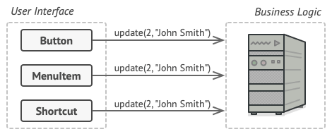

Design Pattern
==============

References:
- [Refactoring Guru](https://refactoring.guru/design-patterns/factory-method)


# Table of Content
## [Creational Patterns](#creational-patterns-2)
1. [Factory Method](#factory-method) 
2. [Abstact Factory](#abstract-factory)
3. [Builder](#builder)
4. [Prototype](#prototype)
5. [Singleton](#singleton)


## [Structural Patterns](#structural-patterns-2)
1. [Adapter](#adapter)
2. [Bridge](#bridge)
3. [Composite](#composite)
4. [Decorator](#decorator)
5. [Facade](#facade)
6. [Flyweight](#flyweight)
7. [Proxy](#proxy)


## [Behavioral Patterns](#)
1. [Chain of Responsibility](#chain-of-responsibility)
2. [Command](#command)
3. [Iterator](#iterator)
4. [Mediator](#mediator)
5. [Memeto](#memeto)
6. [Observer](#observer)
7. [State](#state)
8. [Strategy](#stategy)
9. [Template Method](#template-method)
10. [Visitor](#visitor)

## Creational Patterns
### Factory Method

The Factory Method pattern is a creational design pattern that provides an interface for creating objects but lets subclasses decide which class to instantiate. In other words, the factory method pattern defines an interface for creating an object, but allows the subclasses to decide which class to instantiate based on the requirements.

The Factory Method pattern is useful when there are several classes that implement a common interface, and it is not known at compile time which implementation will be used. The factory method pattern allows for flexibility in creating objects and makes it easy to add new implementations without modifying existing code.

One analogy for the Factory Method pattern is a pizza restaurant. The pizza restaurant has a common interface, which is to make a pizza. However, the type of pizza made depends on the order. The restaurant has several options for pizza, such as pepperoni, cheese, and vegetarian. The order is the client in this scenario, and the pizza chef is the factory. The pizza chef creates the pizza based on the order and returns the appropriate type of pizza to the client.

A sample use case for the Factory Method pattern is in a shopping cart application. Suppose the shopping cart needs to create an object for each item added to the cart. The item may be a book, a toy, or a piece of clothing, and each item has different attributes and behaviors. Rather than having a single class to create objects, the Factory Method pattern can be used to create a separate factory class for each item. The factory class can create the appropriate object based on the item type, which allows for flexibility in adding new items to the cart without modifying existing code.

Another use case for the Factory Method pattern is in a game development application. The game may have several types of characters, such as warriors, mages, and archers. Each character type has different attributes and behaviors, and the appropriate character type needs to be created based on the user's choice. The Factory Method pattern can be used to create a separate factory class for each character type. The factory class can create the appropriate character object based on the user's choice, which allows for flexibility in adding new character types to the game without modifying existing code.

In summary, the Factory Method pattern provides flexibility in creating objects and allows for easy addition of new implementations without modifying existing code. It is useful when there are several classes that implement a common interface, and it is not known at compile time which implementation will be used.


---


Example 1:
```
public enum LogisticType {
    LAND("LAND"),
    SEA("SEA");

    private final String type;

    public LogisticType(String type) {
        this.type = type;
    }
}
```

```
public interface LogisticService {
    void deliver(String destination);
    LogisticType getType();
}
```

```
@Service
public class LandLogisticService implements LogisticService {
    public void deliver(String destination);
        // implementation for credit card payment
    }

    public LogisticType getType() {
        return LogisticType.Land;
    }
}
```

```
@Service
public class SeaLogisticService implements LogisticService {
    public void deliver(String destination);
        // implementation for credit card payment
    }

    public LogisticType getType() {
        return LogisticType.Sea;
    }
}
```

```
@Service
public class LogisticFactory {
    @Autowired
    private List<LogisticService> logisticServices;

    public LogsticService getLogisticService(LogisticType type) {
        return logisticServices.stream
        (
            .filter(logstic -> logistic.getType().equals(type.type))
            .findAny()
            .orElseThrow()-> {
                throw new IllegalArgumentException("Invalid logistic type: " + type);
            }
        );
    }
}
```


## Structural Patterns
### Bridge
The Bridge Design Pattern is a structural design pattern that decouples an abstraction from its implementation, allowing both to vary independently. It involves creating two separate abstraction and implementation hierarchies, and connecting them using a bridge interface. This allows the implementation to be changed or extended without affecting the abstraction, and vice versa.

The Bridge Design Pattern is useful when there are multiple variations in functionality, and the implementation details may change frequently. By separating the abstraction from the implementation, the Bridge pattern allows for more flexibility and scalability in the codebase.

A common use case for the Bridge Design Pattern is in graphical user interfaces (GUIs), where there are multiple types of controls that can be implemented in different ways. For example, a button control can be implemented as a standard button, a dropdown button, or a toggle button. The implementation of each type of button can vary, but the abstraction (the fact that it is a button control) remains the same.

Another use case for the Bridge Design Pattern is in database applications, where there are multiple database systems (such as MySQL, Oracle, or PostgreSQL) that can be used to store data. By separating the abstraction (the database interface) from the implementation (the specific database system), the application can support multiple database systems without needing to modify the codebase.

Suppose you have a music player application that can play different types of audio files such as MP3, WAV, and FLAC. You want to add support for different types of operating systems such as Windows, Linux, and macOS. You can use the bridge design pattern to decouple the abstraction of the music player from the implementation of the operating system. The music player can be the abstraction, and the operating system can be the implementation. The bridge between them can be the operating system interface. By using the bridge design pattern, you can add support for new operating systems without changing the music player code.

Suppose a person who wants to cross a river. They could choose to swim across, but that would be difficult and time-consuming. Instead, they could use a bridge to cross the river quickly and easily. The bridge provides a standardized interface (a path over the river) that can be used by different people (or objects) to cross the river in their own way. In software development, the bridge pattern can be thought of as a way to cross the gap between different abstractions or systems, just as a physical bridge crosses a gap between two points. It allows two or more different systems to work together by providing a standard interface that can be used by each system to communicate with the other.


---


Here is a sample code example in Java to illustrate the Bridge Design Pattern:
```
// Abstraction interface
public interface Shape {
    void draw();
}
```

```
// Concrete implementation
public class Rectangle implements Shape {
    @Override
    public void draw() {
        System.out.println("Drawing a rectangle");
    }
}
```

```
// Concrete implementation
public class Circle implements Shape {
    @Override
    public void draw() {
        System.out.println("Drawing a circle");
    }
}
```

```
// Bridge interface
public interface Color {
    void fill();
}
```

```
// Concrete implementation
public class RedColor implements Color {
    @Override
    public void fill() {
        System.out.println("Filling with red color");
    }
}
```

```
// Concrete implementation
public class BlueColor implements Color {
    @Override
    public void fill() {
        System.out.println("Filling with blue color");
    }
}
```

```
// Abstraction class
public abstract class AbstractShape {
    protected Color color;
    
    public AbstractShape(Color color) {
        this.color = color;
    }
    
    public abstract void draw();
}
```

```
// Refined abstraction class
public class RectangleShape extends AbstractShape {
    public RectangleShape(Color color) {
        super(color);
    }
    
    @Override
    public void draw() {
        System.out.print("Drawing a rectangle shape. ");
        color.fill();
    }
}
```

```
// Refined abstraction class
public class CircleShape extends AbstractShape {
    public CircleShape(Color color) {
        super(color);
    }
    
    @Override
    public void draw() {
        System.out.print("Drawing a circle shape. ");
        color.fill();
    }
}
```

```
// Usage example
public class Main {
    public static void main(String[] args) {
        Color redColor = new RedColor();
        Color blueColor = new BlueColor();
        
        AbstractShape rectangleShape = new RectangleShape(redColor);
        AbstractShape circleShape = new CircleShape(blueColor);
        
        rectangleShape.draw(); // Output: Drawing a rectangle shape. Filling with red color
        circleShape.draw(); // Output: Drawing a circle shape. Filling with blue color
    }
}
```

### Facade
The Facade pattern is a software design pattern that provides a simplified interface to a complex system of classes, interfaces, and APIs. It hides the complexity of the system and provides a simpler interface that the client can use to interact with the system.

The Facade pattern is useful when you have a complex system that needs to be used by multiple clients or when you want to isolate the clients from the complexities of the system. It promotes loose coupling between the client and the system, which makes the system easier to modify and maintain.

The Facade pattern is similar to a concierge at a hotel. The concierge provides a simplified interface to the complex system of services available in the hotel. The guests can use the concierge to book a taxi, reserve a table at a restaurant, or order room service without having to interact with the individual services directly.

In software development, a Facade can be used to provide a simple interface to a complex system of objects or APIs. For example, in a web application, a Facade can be used to provide a simplified interface to a set of APIs that are used to access a database.

Some of the use cases for the Facade pattern include:
- Simplifying the interface to a complex system
- Providing a layer of abstraction between the client and the system
- Promoting loose coupling between the client and the system
- Improving the maintainability and extensibility of the system

An example of using the Facade pattern in a web application is to provide a simplified interface for accessing a database. Instead of exposing the full functionality of the database APIs to the client, the Facade can provide a set of simple CRUD (create, read, update, delete) operations that the client can use to interact with the database. This makes it easier for the client to use the database and also makes it easier to modify the database implementation without affecting the clients.

Another example is providing a simplified interface for a complex system of objects or APIs in a software development framework. For example, in the Spring framework, the Spring JDBC Template class provides a simplified interface for accessing a database. It encapsulates the complexity of the JDBC API and provides a simpler and more intuitive API for interacting with the database.

Suppose we have a complex system that includes several subsystems, each of which has its own set of classes and objects. To simplify the interaction with this system, we could create a facade class that provides a simplified interface to the subsystems.


```
public class SystemFacade {
    private SubsystemA subsystemA;
    private SubsystemB subsystemB;
    private SubsystemC subsystemC;

    public SystemFacade() {
        subsystemA = new SubsystemA();
        subsystemB = new SubsystemB();
        subsystemC = new SubsystemC();
    }

    public void doSomething() {
        subsystemA.doSomething();
        subsystemB.doSomething();
        subsystemC.doSomething();
    }
}
```


## Behavioral Patterns
### Command
The Command pattern is a behavioral design pattern that encapsulates a request as an object, by letting you parameterize clients with different requests, queue or log requests, and support undoable operations.

The main idea behind the Command pattern is to separate the requester of an action from the object that performs the action. This separation provides greater flexibility and allows you to design a system that can handle multiple types of requests, while still keeping it simple and easy to use.

A good example of the Command pattern is a restaurant order system. A waiter takes orders from customers and sends them to the kitchen for processing. In this scenario, the waiter acts as the invoker, and the kitchen acts as the receiver. Each order is a command object that contains all the necessary information to prepare the food, such as the type of dish, the ingredients, and the cooking instructions.

Another example of the Command pattern is a remote control for a TV. The remote control is the invoker, and the TV is the receiver. Each button on the remote control is a command object that sends a specific request to the TV, such as changing the channel, adjusting the volume, or turning the TV on or off.

The Command pattern is useful in situations where you want to decouple the requester of an action from the object that performs the action. It is especially useful in situations where you need to support undoable or redoable operations, as each command object can keep track of its own state and provide an undo or redo method.

In Spring Boot, the Command pattern can be used to encapsulate and execute database transactions. Each command object represents a database operation, such as creating a new record, updating an existing record, or deleting a record. The invoker can then execute the command object, which will perform the database operation and return the result. This allows you to decouple the business logic of your application from the database access layer, making it easier to maintain and test your code.


### [Example](https://refactoring.guru/design-patterns/command)
Imagine that you’re working on a new text-editor app. Your current task is to create a toolbar with a bunch of buttons for various operations of the editor. You created a very neat Button class that can be used for buttons on the toolbar, as well as for generic buttons in various dialogs.


While all of these buttons look similar, they’re all supposed to do different things. Where would you put the code for the various click handlers of these buttons? The simplest solution is to create tons of subclasses for each place where the button is used. These subclasses would contain the code that would have to be executed on a button click.
Lots of button subclasses


Before long, you realize that this approach is deeply flawed. First, you have an enormous number of subclasses, and that would be okay if you weren’t risking breaking the code in these subclasses each time you modify the base Button class. Put simply, your GUI code has become awkwardly dependent on the volatile code of the business logic.


And here’s the ugliest part. Some operations, such as copying/pasting text, would need to be invoked from multiple places. For example, a user could click a small “Copy” button on the toolbar, or copy something via the context menu, or just hit Ctrl+C on the keyboard.

#### Solution
Good software design is often based on the principle of separation of concerns, which usually results in breaking an app into layers. The most common example: a layer for the graphical user interface and another layer for the business logic. The GUI layer is responsible for rendering a beautiful picture on the screen, capturing any input and showing results of what the user and the app are doing. However, when it comes to doing something important, like calculating the trajectory of the moon or composing an annual report, the GUI layer delegates the work to the underlying layer of business logic.

In the code it might look like this: a GUI object calls a method of a business logic object, passing it some arguments. This process is usually described as one object sending another a request.


The Command pattern suggests that GUI objects shouldn’t send these requests directly. Instead, you should extract all of the request details, such as the object being called, the name of the method and the list of arguments into a separate command class with a single method that triggers this request.

Command objects serve as links between various GUI and business logic objects. From now on, the GUI object doesn’t need to know what business logic object will receive the request and how it’ll be processed. The GUI object just triggers the command, which handles all the details.


The next step is to make your commands implement the same interface. Usually it has just a single execution method that takes no parameters. This interface lets you use various commands with the same request sender, without coupling it to concrete classes of commands. As a bonus, now you can switch command objects linked to the sender, effectively changing the sender’s behavior at runtime.

You might have noticed one missing piece of the puzzle, which is the request parameters. A GUI object might have supplied the business-layer object with some parameters. Since the command execution method doesn’t have any parameters, how would we pass the request details to the receiver? It turns out the command should be either pre-configured with this data, or capable of getting it on its own.


#### Coding
```
public interface Command {
    void execute();
    void undo();
}
```

```
public class CopyCommand implements Command {
    private final TextEditor editor;

    public CopyCommand(TextEditor editor) {
        this.editor = editor;
    }

    @Override
    public void execute() {
        editor.copy();
    }

    @Override
    public void undo() {
        editor.clearSelection();
    }
}
```

```
public class PasteCommand implements Command {
    private final TextEditor editor;

    public PasteCommand(TextEditor editor) {
        this.editor = editor;
    }

    @Override
    public void execute() {
        editor.paste();
    }

    @Override
    public void undo() {
        editor.clearSelection();
    }
}
```

```
public class UndoCommand implements Command {
    private final TextEditor editor;

    public UndoCommand(TextEditor editor) {
        this.editor = editor;
    }

    @Override
    public void execute() {
        editor.undo();
    }

    @Override
    public void undo() {
        editor.redo();
    }
}

// ... other command classes for different operations
```

```
public class TextEditorInvoker {
    private final List<Command> commandHistory = new ArrayList<>();
    private final TextEditor editor;

    public TextEditorInvoker(TextEditor editor) {
        this.editor = editor;
    }

    public void executeCommand(Command command) {
        command.execute();
        commandHistory.add(command);
    }

    public void undoLastCommand() {
        if (!commandHistory.isEmpty()) {
            Command lastCommand = commandHistory.remove(commandHistory.size() - 1);
            lastCommand.undo();
        }
    }
}
```

```
TextEditor editor = new TextEditor();
TextEditorInvoker invoker = new TextEditorInvoker(editor);

Command copyCommand = new CopyCommand(editor);
Command pasteCommand = new PasteCommand(editor);
Command undoCommand = new UndoCommand(editor);

invoker.executeCommand(copyCommand);
invoker.executeCommand(pasteCommand);
invoker.executeCommand(undoCommand);

invoker.undoLastCommand();
```

#### Note
The Invoker class in the Command pattern acts as a client for the Command object. It is responsible for invoking the command object's execute() method at the appropriate time. The Invoker typically doesn't know anything about the Command object or what operation it performs. Instead, it simply calls the execute() method on the Command object when needed.

The reason for having an Invoker class is to separate the responsibility of invoking an operation from the operation itself. By doing this, we can decouple the objects that invoke the operation from the objects that perform the operation. This makes the system more flexible and easier to maintain because we can change the way operations are invoked without affecting the objects that perform the operations.

In a Spring Boot application, the Invoker class can be implemented as a service or a controller, depending on the context in which the Command pattern is being used. For example, if the Command pattern is being used to implement an undo/redo functionality, the Invoker class might be implemented as a controller that listens to user input and executes the appropriate Command object's execute() method. On the other hand, if the Command pattern is being used to perform some long-running background operation, the Invoker class might be implemented as a Spring service that runs the command asynchronously.


## READ
- [When to use the Bridge pattern and how is it different from the Adapter pattern?](https://stackoverflow.com/questions/319728/when-to-use-the-bridge-pattern-and-how-is-it-different-from-the-adapter-pattern)

The Bridge pattern is an application of the old advice, "prefer composition over inheritance". It becomes handy when you must subclass different times in ways that are orthogonal with one another. Say you must implement a hierarchy of colored shapes. You wouldn't subclass Shape with Rectangle and Circle and then subclass Rectangle with RedRectangle, BlueRectangle and GreenRectangle and the same for Circle, would you? You would prefer to say that each Shape has a Color and to implement a hierarchy of colors, and that is the Bridge Pattern. Well, I wouldn't implement a "hierarchy of colors", but you get the idea...
 
 When:
```

                   ----Shape---
                  /            \
         Rectangle              Circle
        /         \            /      \
BlueRectangle  RedRectangle BlueCircle RedCircle
```


Refactor to:
```

          ----Shape---                        Color
         /            \                       /   \
Rectangle(Color)   Circle(Color)           Blue   Red
```
